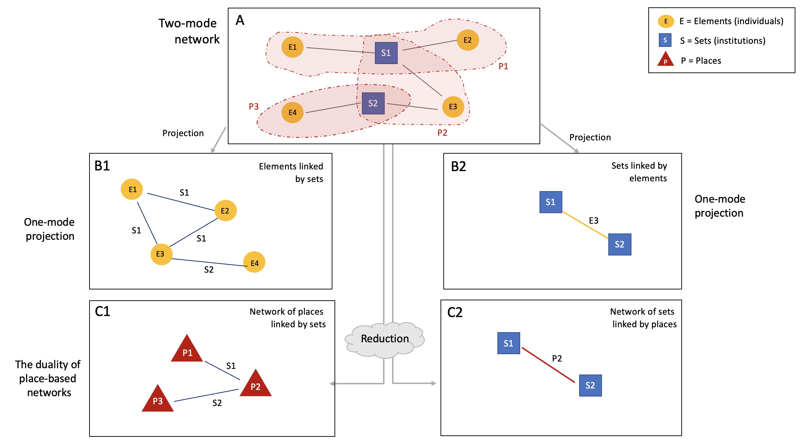
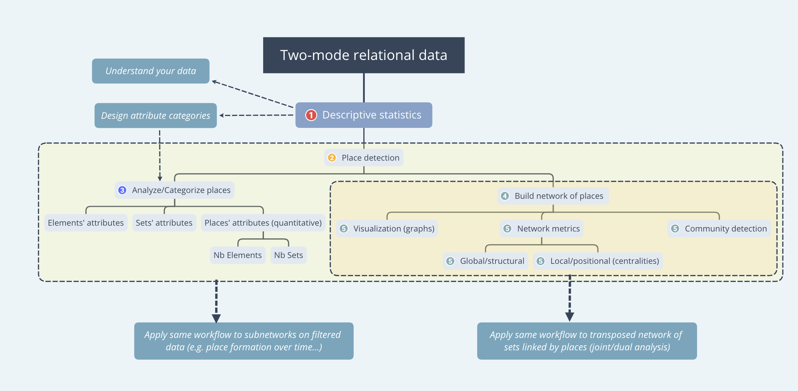

```{r setup, include=FALSE}

## Global options
knitr::opts_chunk$set(echo=TRUE,
        	            cache=FALSE,
                      prompt=FALSE,
                      comment=NA,
                      message=FALSE,
                      warning=FALSE,
                      class.source="bg-info",
                      class.output="bg-warning")


library(dplyr)
#library(Places)
library(igraph)
library(kableExtra)

```


> This paper presents an effective approach for handling two-mode networks, utilizing the concept of 'place' or structural equivalence as its fundamental framework. It primarily relies on the **Places** and **igraph** R packages. To illustrate this method, it employs an edge list representing students and their respective universities in the United States. The data source for this analysis is derived from the directory of an alumni club, specifically the American University Club of Shanghai, which was originally published in 1936. The paper proceeds through four main steps: (1) Identification of places from the edge list, (2) Transformation of the list of places into a network of places, along with its transposed network of universities, (3) Visualization and analysis of the network, including community detection, and (4) Introduction of a more flexible approach grounded in the concepts of regular equivalence or k-places. 

> Prerequisites: Basic notions of network analysis and the **tidyverse** suite.

# Introduction {-}

## Context

Two-mode networks^[__Two-mode network__: A specific kind of network that involves two different types of nodes, such as persons and organizations. Such networks also refer to as affiliation networks or two-mode graphs.], i.e. networks that involve two different types of nodes, such as persons and organizations, represent a significant proportion of network analysis research in the humanities and social sciences. Indeed, it is not always possible to gather first-hand data on direct relationships, such as friendship or family ties. In many situations, social relations are mediated by a third party or have to be inferred from indirect ties, such as school attendance, co-participation in events, membership in clubs or corporate boards.

<div class="alert alert-success" role="alert"> 
In this paper, we interchangeably use the terms "vertex" (plural: "vertices") and "node(s)" to refer to the network's nodes. We alternatively employ the terms "edge(s)" and "tie(s)" to designate the network's edges.</div>

Analyzing two-mode networks raises significant challenges, which have been extensively described in specialized literature [@borgatti_two-mode_2009], [@borgatti_analyzing_2011]. Three major approaches have been commonly deployed. The first approach, which applies algorithms developed for one-mode networks, disregards the unique characteristics of two-mode data and introduces biases that have been discussed in previous works [@borgatti_network_1997]. The second approach involves projecting the original two-mode network into two separate one-mode networks [@everett_dual-projection_2013]. Depending on their interest, researchers typically focus on one projection and discard the other. However, this method has been shown to result in a loss of information and the creation of artificial clustering, which can introduce biases in the interpretation of the data [@newman_random_2001], [@uzzi_collaboration_2005], [@zhou_bipartite_2007]. A third approach, implemented notably in research on interlocks since the 1970s or in ecology, and more recently in other disciplines, maintains the bimodal structure of the studied network. 

The place-based methodology we aim to introduce in this paper offers a powerful alternative to the three mainstream approaches described above, as illustrated on Figure 1. First, it allows for a reduction of the network without sacrificing information. Second, it maintains the inherent duality property found in two-mode networks [@field_identifying_2006]. 

```{r fig-1, echo=FALSE, out.width="100%",  fig.align = 'center', fig.cap= "Figure 1: The place-based methodology"}

```

It is crucial to underscore that, in this context, the concept of *place*^[__Place__: In a two-mode network, a place refers to an assemblage of type-1 nodes that are associated with the exact same set of type-2 nodes. For example, in an affiliation network linking students with the universities they attended, two or more students form a place if they attended the exact same set of one or more universities.] should not be interpreted in a geographical sense. Originally introduced by sociologist Narciso Pizarro [@pizarro_appartenances_2002], [@pizarro_structural_2007], the concept of *place* instead takes inspiration from the notion of *structural equivalence*^[__Structural equivalence__: Two actors in a network are structurally equivalent if they have exactly the same ties to exactly the same other individual actors.] employed in network analysis since the 1970s. Within the framework of individuals affiliated with specific institutions, each 'place' denotes a group of individuals who share the exact same set of institutions. Put differently, individuals are considered part of the same 'place' if they are affiliated with the same institution or combination of institutions.

<div class="alert alert-success" role="alert">
A more flexible approach introduces a tolerance threshold, denoted as k. This allows for *regular equivalence*^[__Regular equivalence__: Two actors are regularly equivalent if they are equally related to equivalent others. That is, regular equivalence sets are composed of actors who have similar relations to members of other regular equivalence sets. It correspond quite closely to the sociological concept of a role.] rather than strict structural equivalence. By setting a value for k, we allow for a certain degree of variation or difference between individuals' affiliations. For example, if we set k = 1, we accept that two individuals may differ by one institution.</div> 

<div class="alert alert-danger" role="alert">
The concept of place is particularly relevant under the following conditions: 

  1. When the data consists of two-mode relational data, such as club membership, interlocking boards, or co-participation in events 
  2. When there is multiple membership, meaning individuals are connected to more than one institution 
  3. When the range of membership per individual is not excessively wide 
  4. When the distribution of members across institutions is not heavily skewed. 

The last two conditions are not strictly necessary, but they significantly facilitate the initial interpretation of places.</div>

While popular software tools like [Cytoscape](https://cytoscape.org/) and [Gephi](https://gephi.org/) do not provide built-in functions for place-based analysis, researchers can resort to the [Places](https://doi.org/10.5281/zenodo.13959942) R package developed by Delio Lucena-Piquero at Science-Po Toulouse. Although there are alternative approaches for addressing structural equivalence in R (such as [netdiffuseR](https://search.r-project.org/CRAN/refmans/netdiffuseR/html/struct_equiv.html) and [concoR](https://rstudio-pubs-static.s3.amazonaws.com/436072_01fce54f3c25458381fee52ec65396fc.html)), the **Places** package is the only available package that specifically focuses on the detection and analysis of places. 

## Packages

This paper relies on the following packages: 

  * [dplyr](https://dplyr.tidyverse.org/) is a powerful and user-friendly tool for data manipulation, providing functions for filtering, selecting, mutating, summarizing, and arranging data frames in an efficient and readable manner.
  * [kableExtra](https://bookdown.org/yihui/rmarkdown-cookbook/kableextra.html) is used to enhance the display of dataframes and make the data more legible.
  * [Places](https://doi.org/10.5281/zenodo.13959942): A package specifically designed to find places in two-mode data. This package has been developed by Delio Lucena-Piquero (Science-Po Toulouse). 
  * [igraph](https://r.igraph.org/): A reference package for building, analyzing and visualizing networks. 

<div class="alert alert-success" role="alert">  
Note that visualization is not **igraph**’s main strength. Other packages such as [tidygraph](https://tidygraph.data-imaginist.com/) can be utilized for improving visual aspects, but this is not the core focus of this paper. Additionally, it may be helpful to export the edge lists for further exploration with network analysis software such as [Gephi](https://gephi.org/) or [Cytoscape](https://cytoscape.org/), which enable greater interactivity.</div> 

## Data

The example data used in this paper was created by the author from a directory of the American University Club of Shanghai published in 1936 [@shanghai_american_1936], [@henriot_bonding_2024]. The original dataset can be downloaded from [Zenodo](https://doi.org/10.5281/zenodo.8047064). It is freely accessible and open for reuse. In this paper, we shall use a simplified version of the original dataset, which we describe below. 

The dataset is typically an *edge list*^[__Edge list__: An edge list is a data structure used in network analysis to represent a graph as a list of its edges.] of individuals linked to the universities they attended. It contains 682 academic curricula distributed among the 418 members of the American University Club of Shanghai. Since the individuals may have obtained several degrees from different universities, they may appear in several rows. Each row refers to a distinct curriculum.  
  
To load the data, we run the following lines:
```{r}

library(readr)

auc <- read_delim("data/auc.csv", delim = ";", escape_double = FALSE, 
                  col_types = cols(Nationality = col_factor(levels = c("Chinese", "Japanese", "Western")), 
                                   Start_year = col_number(), 
                                   End_year = col_number()), 
                  trim_ws = TRUE)

head(auc)
```
The `names()` function lists the columns contained in the data frame and the `summary()` function provides a summary description of the dataset. 
```{r}
names(auc)
```
<br>
The data frame includes the following columns: 

  * Name: The student's name
  * Nationality: The student's national origin (Chinese, Western, Japanese)
  * University: The name of the university attended by the student
  * Degree: The nature of the academic degree obtained by the student
  * Field: The students' major field of study
  * Start_year: The student's year of enrollment or graduation
  * End_year: The year of graduation.
  
```{r}
summary(auc)
```
<br>
The `summary()` function provides useful information about the data. For example, it indicates that there are 401 curricula by Chinese students, 275 by Western students, and 6 by Japanese students. The time span of their studies ranges from 1883 to 1935, with the first degree obtained in 1883 and the last one in 1935, one year before the publication of the book. 

## Workflow

Figure 2 presents a tentative workflow for developing an effective place-based methodology, which comprises essential and optional modules. In this paper, we will focus on:

  1.	Detecting and analyzing places from two-mode data (2 and 3 on Figure 2)
  2.	Creating dual networks of places and sets from the detected places (4)
  3.	Basic network analysis and visualization (5)
  4.	Detecting communities in the dual network (6)
  6.	A brief introduction to regular equivalence and the `k-places()` function.


```{r fig-2, echo=FALSE, out.width="100%",  fig.align = 'center', fig.cap= "Figure 2: Standard workflow for a place-based analysis (<a href='https://xmind.app/mindmap/places-in-two-mode-data-a-workflow/YX2g4H/?from=gallery#' target='_blank'>interactive version</a>)"}

```

# Extracting Places from the Two-Mode Network

The first section aims at detecting and analyzing places from the dataset of students and universities. 

The initial step is to install the **Places** package from [Zenodo](https://doi.org/10.5281/zenodo.13959943): 
```{r warning = FALSE, message = FALSE}
install.packages("https://zenodo.org/records/13959943/files/places_0.2.3.tar.gz", repos = NULL, type = "source")
library(Places)
```


<div class="alert alert-danger" role="alert">
It is important to emphasize that the data must be in a data frame format. One can use the `class()` function to check whether the data is in the proper format and the `as.data.frame()` function to make the necessary conversion, as shown below.</div> 

```{r}
class(auc)
auc <- as.data.frame(auc)
```

 
We can now apply the `place()` function, the key function to detect places. This function is made up of three arguments: 

  * `data`: To specify the input dataset (e.g., the edge list of students and universities, "auc"). The input data must be an edge list.  
  * `col.elements`: To select the source column, designated as "Elements" in the **Places** package terminology (in this specific case, the students). 
  * `col.sets`: To select the target column, designated as "Sets" (i.e., the universities attended by the students). 

```{r message = TRUE}
Result1 <- places(data = auc, col.elements = "Name", col.sets = "University")
```
<div class="alert alert-success" role="alert">  
It is possible to make the code shorter by skipping the name of arguments, as shown below. </div>   
```{r}
Result1 <- places(auc, "Name", "University") 
```
<br>
As indicated in the console, 223 unique places were found from the initial dataset of 418 students (Elements) and 146 universities (Sets). 

The `place()` function returns a list object which contains three data frames: 

  1. The original two-column data frame and the column "Places" with places labels.
  2. A data frame containing information about places.
  3. The network of places in a two-mode edge list format.

The data frame containing information about places includes the following features: 

  * `PlaceNumber`: The number of the place, ordered from the highest to the lowest number of sets. 
  * `PlaceLabel`: The place number, and within parentheses, the number of elements and sets it contains. Labels start with P, followed by the place number, the number of elements in place and the number of sets defining the place.
  * `NbElements`: The number of elements (students) contained in the place. 
  * `NbSets`: The number of sets (universities) in the place. 
  * `PlaceDetail`: This column contains important and detailed information about the places, including the names of all the elements within each place and the sets that define each place. 

To enable further manipulation, we extract the key information in a data frame format. Additionnally, we use **kableExtra** to enhance the table and make the data more legible. Only the first 6 rows are displayed below: 
```{r}
Result1_df <- as.data.frame(Result1$PlacesData) 

library(kableExtra)

kable(head(Result1_df), caption = "First 6 places") %>%
  kable_styling(bootstrap_options = "striped", full_width = TRUE, position = "left")
```

<br>

<div class="alert alert-success" role="alert">
`kable()` is a function from the **knitr** package used for creating tables in a nicely formatted way. `kable_styling()` is a function that sets the styling options for the table:
  <ul>
    <li>`bootstrap_options = "striped"` applies striped row styling, which is a common styling choice in tables;</li>
    <li>`full_width = TRUE` indicates that the table should take up the full width of its container;</li>
    <li>`position = "left"` specifies the position of the table on the page, in this case, aligning it to the left.</li>
  </ul>
</div> 


In the following section, we will conduct a more in-depth examination of the attributes associated with the places.


## Places attributes

We first explore how the students (Elements) are distributed among places using the `table()` function in R base: 
```{r}
table(Result1_df$NbElements)
```
<br>

We can utilize **ggplot2** package to visualize this distribution: 
```{r}
library(ggplot2)

ggplot(data = Result1_df, aes(x = NbElements)) +
  geom_histogram(binwidth = 1, fill = "blue", color = "black", alpha = 0.7) +
  labs(title = "Students by place",
       x = "Number of Students",
       y = "Frequency") +
  theme_minimal()

```
<br>
Explanation: 

  * `ggplot(data = Result1_df, aes(x = NbElements))`: Initializes the ggplot object, specifying the data frame `Result1_df` and the aesthetic mapping `x = NbElements`.
  * `geom_histogram(binwidth = 1, fill = "blue", color = "black", alpha = 0.7)`: Adds the histogram layer to the plot. `binwidth` sets the width of the bins, `fill` and `color` set the fill and border colors, and `alpha` controls the transparency.
  * `labs(title = "Students by place", x = "Number of Elements on X-axis", y = "Frequency")`: Sets the title and axis labels.
  * `theme_minimal()`: Applies a minimal theme to the plot, but you can customize the theme based on your preferences.

The table and histogram below reveal that most places (179, or 80%) consist of unique trajectories centered on a single student. These places are perfectly aligned with individual students. This is an intriguing finding in itself. It suggests something significant about the structure of the network, which can be attributed by historical circumstances. Specifically, the prevalence of these idiosyncratic places reflects the widespread adoption of the elective system in American higher education institutions during the late 19th century.


Similarly, we can explore the distribution the universities (Sets) among places. 
```{r}
table(Result1_df$NbSets)
```
<br>
```{r}
ggplot(data = Result1_df, aes(x = NbSets)) +
  geom_histogram(binwidth = 1, fill = "blue", color = "black", alpha = 0.7) +
  labs(title = "Universities by place",
       x = "Number of Universities",
       y = "Frequency") +
  theme_minimal()

```

<br>
Most places contain a maximum of two universities, meaning that the majority of students attended a maximum of two different universities. This suggests that many students were relatively mobile during their studies and transferred to a different institution to complete their training. Fewer students (25 places) attended more than two universities during their studies. More specifically, 21 places involved students who attended 3 and 4 places involved students who attended 4 different universities.  

## Most significant places 

Beyond crude statistics, we want to gain deeper insights into the students and universities that define each place. The "PlaceDetail" column provides this information. Since examining all 223 places individually would be time-consuming, we can start by focusing on the most populated places, which include a minimum of 2 students and 2 colleges. In this approach, we choose to discard idiosyncratic places that involve only one student or unique curricula. Using the `filter()` function, 13 such places are found. 

```{r}

n2 <- Result1_df %>% 
  filter(NbElements > 1 & NbSets > 1)

kable(n2, caption = "The 13 most significant places") %>%
  kable_styling(bootstrap_options = "striped", full_width = TRUE, position = "left")
```

<br>

In subsequent steps, it is recommended to carefully examine the list of places and their associated details, beginning with the most significant and progressively broadening the selection to encompass less populous places. It is beyond the scope of this paper to extensively describe the places found in this dataset, but I have contributed an in-depth research paper that demonstrates how places can be used to identify typical educational paths and track students who followed similar trajectories [@henriot_bonding_2024]. Interested readers are encouraged to consult this comprehensive research paper for further information.


<div class="alert alert-danger" role="alert">
It is important to emphasize that being part of the same place does not necessarily imply that the individuals actually met or physically interacted.</div> 


## Typology of places

If the data includes qualitative attributes, these attributes can be used to further characterize the places and build a typology. In our example, for instance, we considered the students' field of study and the time of graduation to establish the relative strength of places, as shown in the table below (see also [@henriot_bonding_2024] for an in-depth analysis of the different types of places).  

<style type="text/css">
.tg  {border-collapse:collapse;border-spacing:0;}
.tg td{border-color:black;border-style:solid;border-width:1px;font-family:Arial, sans-serif;font-size:14px;
  overflow:hidden;padding:10px 5px;word-break:normal;}
.tg th{border-color:black;border-style:solid;border-width:1px;font-family:Arial, sans-serif;font-size:14px;
  font-weight:normal;overflow:hidden;padding:10px 5px;word-break:normal;}
.tg .tg-2vf8{background-color:#FFF;color:#404040;font-family:inherit;font-weight:bold;text-align:left;vertical-align:top}
.tg .tg-homa{background-color:#FFF;font-family:inherit;font-weight:bold;text-align:center;vertical-align:top}
.tg .tg-59kb{background-color:#FFF;color:#404040;font-family:inherit;text-align:center;vertical-align:top}
.tg .tg-h04j{background-color:#F3F6F6;color:#404040;font-family:inherit;font-weight:bold;text-align:left;vertical-align:bottom}
.tg .tg-i610{background-color:#F3F6F6;color:#404040;font-family:inherit;text-align:center;vertical-align:top}
</style>
<table class="tg"><thead>
  <tr>
    <th class="tg-homa"></th>
    <th class="tg-homa"><span style="font-weight:bold;background-color:white">Same Time</span></th>
    <th class="tg-homa"><span style="font-weight:bold;background-color:white">Different Time</span></th>
  </tr></thead>
<tbody>
  <tr>
    <td class="tg-2vf8"><span style="font-weight:bold">Same Discipline</span></td>
    <td class="tg-59kb">Type A: Strong potential for regular interaction (4 places, 9%)</td>
    <td class="tg-59kb">Type C: Potential for later collaboration (7 places, 16%)</td>
  </tr>
  <tr>
    <td class="tg-h04j"><span style="font-weight:bold">Different Discipline</span></td>
    <td class="tg-i610">Type B: Potential for extra-curricula interaction (8 places, 18%)</td>
    <td class="tg-i610">Type D: Shared academic experience and cultural background (25 places, 32%)</td>
  </tr>
</tbody>
</table>


**Type A** places represent the strongest potential for direct interaction, as they involve students who enrolled in the same programs at the same time, likely attending the same classes. In our population, there are four places of this type, all featuring students in sciences or engineering who graduated during or after World War I (P032, P033, P037, P173). 
<br>
**Type B** places are characterized by potential interactions outside the classroom setting. While students in these places may not have enrolled in the same courses, their paths could have crossed on campus through various extracurricular activities. An illustrative example of a Type B place is represented by physician Yan Fuqing (顔福慶) (Yen Fu-ching) and businessman Cao Maoxiang (曹蝥祥) (Y.S. Tsao), who attended Yale and Harvard between 1909 and 1914 (P038). 
<br>
**Type C** places refer to students who attended the same universities and graduated in the same disciplines but at different periods of time. Although these students did not have the opportunity to physically interact on campus, their shared educational background created a potential for future collaborations and intergenerational connections. For instance, economist Ma Yinchu (馬寅初) graduated from Yale and Columbia in 1910–1914, a decade before banker Lin Zhang (林障) completed his studies at the same institutions in 1920–1922 (P034).
<br>
**Type D** places represent the weakest form of association, bringing together students from different generations who pursued diverse academic disciplines at the same alma mater. For instance, place P161 exemplifies a Type D place where three graduates from Stanford University, spanning a period between 1905 and 1922, pursued distinct fields of study ranging from engineering to the humanities. These multigenerational and multidisciplinary places encompass a significant number of students, often exceeding ten individuals, who share a common educational institution.

<div class="alert alert-success" role="alert">  
This part is not directly reproducible because it depends on the intrinsic qualities of the dataset. Nevertheless, it is worth mentioning because the rationale can be adapted to other data and research questions. The places were manually coded based on the attributes of the universities and the students they encompassed. For students, the attributes considered were nationality, period of study, and the nature of their degree. For universities, the coding was based on the region in which they were located (East Coast, West, or Midwest).</div>

While it is beyond the scope of this study to detail the methodology used for classifying places, we provide the typology below as an illustration, used to compute the number of places in each category. We hope this case study inspires other researchers to create their own typology of places, tailored to their research questions and data attributes. 

```{r}
# load data 
placetypo <- read_delim("data/placetypo.csv", 
    delim = "\t", escape_double = FALSE, 
    col_types = cols(...1 = col_skip()), 
    trim_ws = TRUE)

kable(head(placetypo)) %>%
  kable_styling(bootstrap_options = "striped", full_width = TRUE, position = "left")
```
<br>

We count the number of places for each type using the `group_by()` and `count()` functions: 

```{r}
placetypo %>% 
  group_by(Type) %>% 
  count(sort = TRUE)
```


In the following section, we will demonstrate how to construct and analyze networks of places in order to investigate the structure and dynamics of two-mode networks, taking Sino-American alumni networks as a specific case. 

# Creating A Network of Places & A Network of Sets (Reduction)

## Creating Networks 

As highlighted earlier, the result of place detection includes an edge list of places linked by sets (designated as "Edgelist"). We can take advantage of this list to build a network of places linked by universities (Sets) and its transposed network of universities (Sets) linked by places. This involves performing a dual projection, referred to as "reduction" in Figure 1, but applied to the places and sets rather than the students and universities.

To build a network of places linked by universities, we begin by creating an adjacency matrix^[__Adjacency Matrix__: An adjacency matrix is a matrix used to represent a finite graph. The elements of the matrix indicate whether pairs of vertices are adjacent or not in the graph.] from the edge list: 

```{r}
bimod <- table(Result1$Edgelist$Places, Result1$Edgelist$Set) 
PlacesMatrix <- bimod %*% t(bimod)
diag(PlacesMatrix) <- 0 
```
<br>
In essence, the chunk above creates a two-mode network representation using a contingency table (here `bimod`) and then computes the cross-product of this bimodal matrix with its transpose to create a square matrix (`PlacesMatrix`). Finally, it sets the diagonal elements of this matrix to $0$. The resulting matrix may be used for analyzing relationships or patterns between places and sets in the context of the data stored in `Result1$Edgelist`. Below, we provide a detailed explanation of the code, line by line: 

  * `table(Result1$Edgelist$Places, Result1$Edgelist$Set)`: Uses the `table()` function to create a contingency table (cross-tabulation) of the occurrences of each combination of values in the vectors `Result1$Edgelist$Places` and `Result1$Edgelist$Set`. The result, assigned to the object `bimod`, is a two-dimensional table.
  * `bimod %*% t(bimod)`: Performs matrix multiplication. The `%*%` operator is used for matrix multiplication, and `t(bimod)` transposes the matrix `bimod`. The result is a matrix called `PlacesMatrix` that represents the cross-product of `bimod` and its transpose.

Next, we use the `graph_from_adjacency_matrix()` function included in the **igraph** package to transform the matrix into a network of places linked by universities.

```{r}
library(igraph)
Net1 <- graph_from_adjacency_matrix(adjmatrix = PlacesMatrix, mode="undirected", weighted = TRUE)
```

<br>
We apply the same method for building the transposed network of universities:

```{r}

bimod2 <- table(Result1$Edgelist$Set, Result1$Edgelist$Places)
PlacesMat2 <- bimod2 %*% t(bimod2)
diag(PlacesMat2) <- 0

Net2 <- graph_from_adjacency_matrix(adjmatrix = PlacesMat2, mode="undirected", weighted = TRUE)
```
<br>
An alternative method of projection is provided below. 
```{r}
# Creating a network from the list of Places links
Net <- graph_from_data_frame(Result1$Edgelist, directed = FALSE)
# Transformation into a 2-mode network
V(Net)$type <- bipartite_mapping(Net)$type
# Projection
projNet <- bipartite_projection(Net, multiplicity = TRUE)
Net1 <- projNet$proj1  # Network of elements/places
Net2 <- projNet$proj2  # Network of sets (universities)
```


<div class="alert alert-success" role="alert"> 
If you aim to inspect visually your network, using [Cytoscape](https://cytoscape.org/) or [Gephi](https://gephi.org/) might be helpful. In this case, you need to convert your igraph objects into edge lists and export them as comma separated value (.csv) files, as shown below.</div> 

```{r}
# Convert igraph objects into edge lists (not run in this session)
  # edgelist1 <- as_edgelist(Net1)
  # edgelist2 <- as_edgelist(Net2)
# Export edge lists and node lists as csv files (not run in this session)
  # write.csv(edgelist1, "edgelist1.csv")
  # write.csv(Result1_df, "nodelist1.csv")
  # write.csv(edgelist2, "edgelist2.csv")
```

## Visualizing Networks

Let's plot the network of places linked by universities: 

```{r}
plot(Net1, 
     vertex.size = 5, 
     vertex.color = "orange", 
     vertex.label.color = "black", 
     vertex.label.cex = 0.3, 
     main = "Network of places linked by universities")
```

<br>
In the network of places linked by sets (universities), isolated nodes refer to places with only one student who attended only one university, such as P200(1-1), which refers to N.E. Lurton, who studied exclusively at Benton University. 
     
```{r}
plot(Net2, 
     vertex.size = 5, 
     vertex.color = "light blue", 
     vertex.label.color = "black", 
     vertex.label.cex = 0.3, 
     main = "Network of universities linked by places")
```
<br>
In the network of sets (universities) linked by places, isolated nodes refer to universities attended by students who did not study at any other university.

The `plot()` function from the **igraph** package includes various arguments. The first argument is required, as it specifies the network object to be plotted. The other arguments are optional. In the above example, we specified the following arguments: 

  * `vertex.size`: Size of vertices (or nodes) 
  * `vertex.color`: Color of vertices
  * `vertex.label.color`: Color of vertices labels
  * `vertex.label.cex`: Size of vertices labels
  * `main`: Title for the graph. 
  
We can remove the labels to improve legibility and adjust the node sizes according to the number of students in each place, to add meaningful information: 
```{r}
plot(Net1, 
     vertex.size = Result1_df$NbElements,
     vertex.color = "orange", 
     vertex.label = NA,
     layout = layout_components,
     main = "Network of places linked by universities")
```
<br>
For the graph of universities linked by places, we can adjust the node sizes according to the number of students attending each university:  
```{r}
univ_count <- auc %>% 
  group_by(University) %>% 
  count()

plot(Net2, 
     vertex.size = univ_count$n/2, 
     vertex.color = "light blue", 
     vertex.label = NA, 
     layout = layout_components,
     main = "Network of universities linked by places")
```

  
As evident from the plots, the two networks are each made up of a large, densely connected component surrounded by a myriad of isolated nodes and smaller components, which refer to the singular curricula described in the previous section. To substantiate this preliminary visual exploration, it is recommended to turn to network metrics. 

## Applying One-Mode Network Metrics to Places and Sets

In network analysis, we usually distinguish between global metrics, which serve to characterize the overall structure of the network, and local metrics, which characterize the vertices and their relative position in the network.  

### Global Metrics

There are many metrics to define the structure of networks. In the following, we focus on the most basic ones, which can be computed with the following functions from the **igraph** package: 

  * `summary()`: Provides summary statistics on the network (nature of the network, number of vertices and ties, attributes if applicable)
  * `edge_density()`: Density of the graph
  * `count_components()`: Number of components
  * `components()$size`: Size of components
  * `table(E()$weight)`: Table of edge weight.
  
```{r}
summary(Net1)
summary(Net2)
```
<br>
In both cases, the summary indicates that the two networks are undirected (U), named (N), weighted (W) networks (UNW), which are the options chosen during the transformation. The network of places linked by universities (Net1) contains 223 vertices (places) and 1,606 ties (sets of universities). The network of universities linked by places includes 146 vertices (sets of universities) and 197 ties (places). The name of vertices is the only attribute.   

```{r}
edge_density(Net1)
edge_density(Net2)
```
<br>
The `edge_density()` function is useful mostly when comparing networks of similar order (with similar number of vertices). In our example, the network of places linked by universities is denser than the network of universities linked by places.

```{r}
count_components(Net1)
count_components(Net2)
```
<br>
The two networks comprise 39 components each.  
```{r}
components(Net1)$csize
components(Net2)$csize
```
<br>
The results show the size of the components. The largest component includes 184 vertices. The remaining components include one dyad and a myriad of isolated vertices. The largest component in the network of universities includes 105 vertices. The other components includes one triad, one dyad, and a myriad of isolated vertices. 

Since the networks are weighted, it is interesting to examine the relative weight of ties by simply using the `table()` function in base R. 
```{r}
table(E(Net1)$weight)
table(E(Net2)$weight)
```
<br>
The network of places consists mostly of simple ties (1,594) and 12 ties with a weight of 2. These 12 ties represent pairs of places that share 2 sets (i.e., 2 two different combinations of universities). Similarly, the network of universities also consists primarily of simple ties (190), along with 6 ties of weight 2 (6 pairs of universities sharing 2 places) and one tie of weight 4 (one pair of universities sharing 4 places).

Let's find out what are these most significant pairs by filtering the ties whose weight is superior to 1:  
```{r}
E(Net1)[weight > 1]
E(Net2)[weight == 2]
E(Net2)[weight == 4]
```
<br>
The results indicate that the most frequent circulations occurred between Columbia and New York University, which largely reflects their geographical proximity, as both universities are located in New York City. Other important ties link more distant universities, such as California and Columbia, or Hawaii and the University of Pennsylvania, which suggests that physical proximity was not the only factor accounting for the students' mobility. Further investigation is required to understand the logic underlying these strong ties, but one advantage of network analysis is to point out connections that would otherwise remain unnoticed.  

### Local Metrics

There are many metrics to measure the relative position of vertices in networks. In the following, we focus on the most popular centrality metrics, which can all be computed with the **igraph** package. 

  * **Degree**: The number of ties a node has. It is the simplest measure of centrality. In the following, we use a normalized version of the measure in order to enable comparisons across networks built from different data structure. Since the projected networks are valued, it is also possible to calculate a weighted degree based on the intensity of the links. In the network of universities linked by places, for example, it measures the number of connections or ties (e.g., places) each university has with other universities in the network. It can be interpreted as a measure of university popularity or the extent to which a university is actively connected to other institutions.
  * **Eigenvector**: The number of connections a node has to other well-connected nodes. It is a measure of the influence of a node in a network. In the network of universities, it quantifies the extent to which a university is connected to other influential universities. Universities with high eigenvector centrality are connected to other highly influential institutions, indicating their own influence and prestige.
  * **Betweenness**: The number of times a node acts as a bridge along the shortest path between two other nodes. In this sense, the more central a node is, the greater control it has over the flows that goes through it. It is often considered as a measure of brokerage, or the capacity of a node to mediate between other nodes. In the network of universities linked by places, it quantifies the university’s brokering power or the frequency with which it falls on the shortest path between other universities. Universities with high betweenness centrality play a crucial role in connecting different parts of the network and facilitating students' exchanges between institutions. 
  * **Closeness**: The average length of the shortest path between the node and all other nodes in the graph. In this sense, the more central a node is, the closer it is to all other nodes. It measures how quickly influence can spread from one university to another through direct or indirect connections. Universities with high closeness centrality are considered central in terms of being well-connected and easily reachable within the network. This is particularly relevant in the subnetwork of specialized institutions, such as the Massachusetts Institute of Technology.


Since betweenness and closeness centralities make sense only in fully connected networks, we first need to extract the main component in each network. We can resort to the `components()` function to find the ID number of the largest component in each network. In this specific case, the largest is component n°1 in Net1 and n°1 in Net2. Then, we  apply the `induced_subgraph()` function to extract these components:
```{r}
# components(Net1) (not run in this session)
# components(Net2) (not run in this session)

Net1MC <- induced_subgraph(Net1, vids = components(Net1)$membership == 1)
Net2MC <- induced_subgraph(Net2, vids = components(Net2)$membership == 1)
```
<br>
The following code serves to compute the centrality metrics in the network of universities and compile them in a coherent data frame. We chose to normalize degree centrality to facilitate comparisons with other metrics and across networks. 
```{r}
Degree2 <- degree(Net2MC, normalized = TRUE) 
Eig2 <- eigen_centrality(Net2MC)$vector 
Betw2 <- betweenness(Net2MC)
univ_metrics <- cbind(Degree2, Eig2, Betw2) 
univ_metrics_df <- as.data.frame(univ_metrics)

head(univ_metrics_df %>% arrange(desc(Degree2)))
```
<br>
The table presents the first 6 universities ranked by degree centrality. Columbia University clearly stands out, meaning that it attracted the largest number of students. Columbia also has the highest eigenvector centrality, which means that it was connected to other important universities. It also shows a high betweenness centrality score, meaning that it serves as an important bridge in the academic network.   

We can visualize the relative importance of universities in the network by indexing the size of vertices on their centrality metrics. In the following example, we chose to make the size of vertices proportionate to their degree centrality.  

```{r}
plot(Net2MC,
     vertex.color = "light blue",
     vertex.shape = "circle",
     vertex.size = degree(Net2MC)/2, 
     vertex.label.color = "black", 
     vertex.label.cex = degree(Net2MC)/100, 
     main = "Network of universities",
     sub = "The size of vertices represents their degree centrality.")
```

<br>
In my article [@henriot_bonding_2024], I demonstrated how centrality metrics can be used to categorize universities and to study the formation of university rankings based on their position in the networks. Interested readers are invited to consult this paper for further information. 

<br>
Based on this initial investigation, it is evident that the networks of Sino-American alumni exhibit significant heterogeneity, consisting of various subgroups and communities that are connected with differing degrees of density. In the upcoming section, we will delve into the application of community detection to identify subgroups of more densely connected nodes within the two networks.  

# Communities of Places and Sets

The purpose of this section is twofold. Substantively, to understand how academic communities took shape through the interconnection of students’ trajectories (the reader can transpose the concepts of place and community to his own data and research questions). Methodologically, to illustrate the duality of place-based networks and to demonstrate the value of jointly analyzing the network of places (elements) and its transposed network of universities (sets). 
  
The **igraph** package offers [various methods](https://igraph.org/r/doc/communities.html) for detecting communities. In this paper, we selected the Louvain algorithm [@blondel_fast_2008], one of the most popular methods for finding communities, especially but not exclusively in large networks.   

<div class="alert alert-success" role="alert"> 
To keep this paper simple, we opted to concentrate on the initial outcome of the Louvain algorithm. Nevertheless, it is advisable to examine and contrast various algorithms and multiple iterations of the same algorithm. These variations can potentially yield distinct results, which might significantly influence the ultimate conclusions.</div>

## Finding Communities 

To detect communities with the Louvain algorithm, we apply the `cluster_louvain()` function included in **igraph**. We continue to focus on the main component to avoid the detection of artificial clusters made up of isolated nodes: 
```{r}
lvc1 <- cluster_louvain(Net1MC)
lvc2 <- cluster_louvain(Net2MC)
```
<div class="alert alert-danger" role="alert"> The `cluster_louvain()` function changes the .Random.seed in R. The results you obtain may vary slightly from those shown below.</div>

```{r echo=FALSE}
# Choix éditorial :
# Imports des résultats de clustering pour une question de reproductibilité stricte
# et rendre cohérents les résultats décrits dans la suite de l'article.
# La fonction cluster_louvain() change la .Random.seed.
# Le chunck n'est pas apparent car il n'est pas nécessaire dans le déroulé de l'article. 
# Un warning est toutefois ajouté dans le corps du texte pour que les lecteurs ne soient pas perturbés s'ils n'ont pas strictement les mêmes résultats.
lvc1 <- readRDS(file = "data/lvc1.rds")
lvc2 <- readRDS(file = "data/lvc2.rds")
```


<br>
Let's inspect the results: 
```{r}
print(lvc1)
print(lvc2)
```
<br>
The algorithm found 7 communities of places and 8 communities of universities. The modularity scores^[__Modularity score__: In network analysis, the modularity score measures the strength of a clustering method on a scale ranging from −0.5 to 1. It indicates how well groups have been partitioned into clusters. It compares the relationships within a cluster to what would be expected from a random (or other baseline) number of connections. Modularity measures the quality (i.e., presumed accuracy) of a community grouping by comparing its relationship density to a suitably defined random network. The modularity quantifies the quality of an assignment of nodes to communities by evaluating how much more densely connected the nodes within a community are, compared to how connected they would be in a random network.] ("mod" result) are quite satisfactory (0.52 and 0.49, respectively). As shown in the results below, the size of communities ranges from 10 to 42 vertices in the network of places, and from 6 to 21 vertices in the network of universities. 

```{r}
table(sizes(lvc1))
table(sizes(lvc2))
```
<br>
In the next section, we will show how to visualize the communities. 

## Visualizing Communities

### Network of Places

First, we create a group for each community and we set a different color for each group. 
```{r}
V(Net1MC)$group <- lvc1$membership # create a group for each community
V(Net1MC)$color <- lvc1$membership # node color reflects group membership 
```
<br>
Next, we plot the communities using the `plot()` function. 
```{r}
plot(lvc1, Net1MC, 
     vertex.label = NA,
     vertex.label.color = "black", 
     vertex.label.cex = 0.5, 
     vertex.size = 1.8,
     main = "Communities of places", 
     sub = "Louvain method")
```
<br>
On the clustered plot, black ties connect vertices within each group, whereas red ties link vertices across different communities. 

### Network of Sets (Universities)

Similarly, we create a group for each community of universities and we set a different color for each group.  
```{r}
V(Net2MC)$group <- lvc2$membership
V(Net2MC)$color <- lvc2$membership
```
<br>
Next, we plot the communities. 
```{r}
plot(lvc2, Net2MC, 
     vertex.label = NA,
     vertex.label.color = "black", 
     vertex.label.cex = 0.5, 
     vertex.size = 3,
     main = "Communities of universities", 
     sub = "Louvain method")
```
<br>
We need to acknowledge that these visualizations contain an overwhelming amount of information, which impose significant limitations on their practical utility. To facilitate a meaningful interpretation of the results, it is preferable to extract and scrutinize each community separately.

## Extracting Communities

The following code serves to retrieve the membership information contained in the results of community detection (`lvc1$membership`) in a coherent data frame. Additionally, we compute the size of communities and we join this data with the detailed description of the places.    
```{r}
place_clusters <- data.frame(lvc1$membership, lvc1$names) %>% 
  group_by(lvc1.membership) %>% 
  add_tally() %>% # add size of clusters
  rename(PlaceLabel = lvc1.names, cluster_no = lvc1.membership, cluster_size = n) %>%
  select(cluster_no, cluster_size, PlaceLabel)

place_clusters <- inner_join(x = place_clusters, y = Result1_df, by = "PlaceLabel") 


kable(head(place_clusters), caption = "Communities of places (first 6 places)") %>%
  kable_styling(bootstrap_options = "striped", full_width = TRUE, position = "left")

```
<br>
We follow the same method for extracting community membership in the network of universities: 
```{r}
univ_clusters <- data.frame(lvc2$membership, lvc2$names) %>% 
  group_by(lvc2.membership) %>%  
  add_tally() %>%
  rename(University = lvc2.names, cluster_no = lvc2.membership, cluster_size = n) %>%
  select(cluster_no, cluster_size, University)

kable(head(univ_clusters), caption = "Communities of universities (first 6 places)") %>%
  kable_styling(bootstrap_options = "striped", full_width = TRUE, position = "left")

```

<br>
In the following steps, we extract the communities of places as individual sub-networks. 
```{r}
gp1 <- induced_subgraph(graph = Net1MC, vids = V(Net1MC)$group == 1)  
gp2 <- induced_subgraph(Net1MC, V(Net1MC)$group == 2) 
gp3 <- induced_subgraph(Net1MC, V(Net1MC)$group == 3) 
gp4 <- induced_subgraph(Net1MC, V(Net1MC)$group == 4) 
gp5 <- induced_subgraph(Net1MC, V(Net1MC)$group == 5) 
gp6 <- induced_subgraph(Net1MC, V(Net1MC)$group == 6)
gp7 <- induced_subgraph(Net1MC, V(Net1MC)$group == 7)
```
<br>
Similarly, we extract the communities of universities. 
```{r}
gu1 <- induced_subgraph(Net2MC, V(Net2MC)$group == 1)  
gu2 <- induced_subgraph(Net2MC, V(Net2MC)$group == 2) 
gu3 <- induced_subgraph(Net2MC, V(Net2MC)$group == 3) 
gu4 <- induced_subgraph(Net2MC, V(Net2MC)$group == 4) 
gu5 <- induced_subgraph(Net2MC, V(Net2MC)$group == 5) 
gu6 <- induced_subgraph(Net2MC, V(Net2MC)$group == 6)
gu7 <- induced_subgraph(Net2MC, V(Net2MC)$group == 7)
gu8 <- induced_subgraph(Net2MC, V(Net2MC)$group == 8)
```

<br>
To illustrate the duality of place-based networks, we will plot the corresponding communities of places and universities to visually compare their structure.  

## Visual Comparisons

Using this method, three main categories of communities can be identified based on their topological structure.

**a. Star-like communities** are characterized by a prominent and highly influential university that attracts students from a wide range of smaller institutions. Columbia University serves as a prime example, having developed into a comprehensive institution with diverse academic offerings and exceptional resources for postgraduate research. Its reputation and extensive curriculum make it an attractive destination for students seeking a broad educational experience.

The two plots below compare the Columbia-centered community and the corresponding community of places. The hairball structure of the community of places is transposed into the star-like structure of the community of universities: 
```{r}
plot(gp1, 
     vertex.label = V(Net1MC)$id,
     vertex.label.color = "black", 
     vertex.label.cex = 0.5, 
     vertex.size = 5,
     main = "Columbia community (places)")
```

```{r}
plot(gu1, 
     vertex.label = V(Net2MC)$id,
     vertex.label.color = "black", 
     vertex.label.cex = degree(gu1)*0.15, # label size proportionates to node degree (in cluster)*0.15
     vertex.size = degree(gu1)*1.5, # same for node size*1.5
     main = "Columbia community (universities)")
```
<br>

**b. Chain-type communities** can be observed in two scenarios. First, in specialized curricula like engineering and technical studies, institutions such as MIT and Purdue University form chains where student mobility is limited due to the specialized nature of their programs. Second, in cases when American students are dispersed across numerous peripheral institutions with little curricular coherence, chain structures also emerge, as illustrated by the Princeton community below: 
```{r}
plot(gp2, 
     vertex.label = V(Net1MC)$id,
     vertex.label.color = "black", 
     vertex.label.cex = 0.5, 
     vertex.size = 5,
     main = "Princeton Community (places)")
```

```{r}

plot(gu2, 
     vertex.label = V(Net2MC)$id,
     vertex.label.color = "black", 
     vertex.label.cex = degree(gu2)*0.15, 
     vertex.size = degree(gu2)*1.5,
     main = "Princeton community (universities)")

```
<br>

**c. Hybrid structures** consist of two equally central institutions that have established their own networks of feeder colleges. These institutions not only exchange students but also complement or compete in terms of program offerings. For example, Cornell and the University of California attracted students who navigated between the two due to their strong programs in science, engineering, and agriculture: 

```{r}
plot(gp5, 
     vertex.label = V(Net1MC)$id,
     vertex.label.color = "black", 
     vertex.label.cex = 0.5, 
     vertex.size = 5,
     main = "Cornell Community (places)")
```

```{r}
plot(gu6, 
     vertex.label = V(Net2MC)$id,
     vertex.label.color = "black", 
     vertex.label.cex = degree(gu6)*0.3, 
     vertex.size = degree(gu6)*2,
     main = "Cornell community (universities)")
```

For an in-depth analysis of university and place-based communities, please refer to my aforementioned paper [@henriot_bonding_2024], where I demonstrate how the joint analysis of communities of places and universities can be used to examine patterns of student mobility within selected groups of universities. 

<div class="alert alert-success" role="alert">
These visual observations can be corroborated by retrieving the global metrics of each community. To maintain brevity in this paper, we do not undertake this process here. Interested readers are encouraged to consult the [comprehensive documentation](https://bookdown.enpchina.eu/AUC/Places3.html#Structural_analysis) produced by the author for further details.</div>  

# From Structural Equivalence to Regular Equivalence: The *k-Places* Function

The final section introduces the notion of *regular equivalence* as a more flexible approach to places or structural equivalence. 

The **Places** package includes a `k-places()` function which is specifically designed to identify regular equivalence patterns within two-mode networks. The `k-places()` function is very similar to the `place()` function. It includes four main arguments: 

  * `data`: The input data frame (auc)
  * `col.elements`: The name of the column of elements (e.g., students)
  * `col.sets`: The name of the column of sets (e.g., universities)
  * `k`: A natural number that indicates the tolerance threshold.
  
In the following example, we set $k = 1$, meaning that we tolerate only one difference among the universities attended by students.   
```{r}
Result2 <- kplaces(data = auc, col.elements = "Name", col.sets = "University", k = 1)
Result2 <- kplaces(auc, "Name", "University", 1) # shorter version, same results
```
<br>
From the initial edge list of 418 students and 146 universities, 219 places and 2 k-places (or "ambiguous cases") were found. 
  
The `k-places()` function returns a list with four data frames: 

  1. The original two-column data frame and the column "Places" with places labels. 
  2. A data frame containing information about places and k-places.
  3. A data frame with the relation of places merged to k-places and the sets in common.
  4. The network of places in a two-mode edgelist format.

The data frame (2) containing information about places and k-places includes the following features: 

  * `PlaceLabel` contains places and k-places labels. Places labels start with P, followed by the place number, the number of elements in place and the number of sets defining place. K-places labels start with P, followed by the k-place number, an *, the number of elements in k-place, the number of sets in common, and the value of $k$.
  * `NbElements` contains the number of elements in the place or k-place.
  * `NbSets` contains the number of sets defining the place or k-place.
  * `PlaceDetail` contains the name of all the elements in the place or k-place and all the sets defining the place or k-place. 

Let's extract the information about places and k-places: 
```{r}
Result2_df <- as.data.frame(Result2$KPlacesData) 

kable(head(Result2_df), caption = "First 6 places/kplaces") %>%
  kable_styling(bootstrap_options = "striped", full_width = TRUE, position = "left")
```
<br>
Next, we focus on k-places and identify the sets they have in common. 
```{r}

Result2k_df <- as.data.frame(Result2$kPlaces) 

kable(Result2k_df, caption = "Kplaces, corresponding places and common sets") %>%
  kable_styling(bootstrap_options = "striped", full_width = TRUE, position = "left")

```
<br>
The 2 k-places identified contain 2 elements (students) and 3 sets (universities). They have 2 sets in common and one difference: 

  * P007*(2-3-2-1) includes F. Sec Fong and Edward Y.K. Kwong who both attended Columbia University and Pomona College. They differ in that Fong F. Sec also attended the University of California, whereas Edward Y.K. Kwong did not. The differences can be viewed by consulting the "PlaceDetail" column in the previous table.
  * P017*(2-3-2-1) includes H.C.E. Liu and Jui-Ching Hsia who both attended the University of Chicago and Columbia University. Additionally, H.C.E. Liu studied at Denison University, whereas Jui-Ching Hsia did not.

# Conclusion

This paper has laid the foundations for a standard workflow based on the **Places** R package, which can be reused and adapted for other research across diverse disciplinary fields. This method can be applied to virtually any type of nodes, not only human and social actors, but also objects, concepts, and other entities. Furthermore, it can be extended to multimodal networks involving more than two different types of nodes. For example, the places could encompass not only the universities attended by the students but also their place of birth or the institutions in which they were employed. Interested readers can refer to my article [@henriot_bonding_2024], which provides a detailed demonstration of the multiple possible uses of place-based networks to advance historical findings. Specifically, this article explores how the network was used to identify typical trajectories among American and Chinese alumni, examines how these educational trajectories shaped future careers and collaborations, and traces the formation of places and the emergence of university rankings over time. Ultimately, we hope this paper will inspire innovative research based on this framework. 


<div class="alert alert-success" role="alert">
The curious reader can refer to the extensive documentation produced by the author on [place detection](https://bookdown.enpchina.eu/AUC/Places1.html), [network projection](https://bookdown.enpchina.eu/AUC/Places2.html), [community detection](https://bookdown.enpchina.eu/AUC/Places3.html), and [place formation over time](https://bookdown.enpchina.eu/AUC/Places4.html). </div> 

<div class="alert alert-success" role="alert">
**Acknowledgments**: I am grateful to Delio Lucena-Piquero, the creator of the **Places** package, for his assistance and valuable suggestions for improving the documentation mentioned above. I extend my thanks to Prof. Jiang Jie (Shanghai University) for providing me with a digital copy of the original source book from which the example dataset was created. </div>


# Bibliography {-}

<div id="refs"></div>

## Glossary {- #endnotes}

```{js, echo=FALSE}

$(document).ready(function() {
  $('.footnotes ol').appendTo('#endnotes');
  $('.footnotes').remove();
});

```

# Annexes {-}

## Info session de l'édition  {-}

```{r session_info, echo=FALSE}
kableExtra::kable_styling(knitr::kable(rzine::sessionRzine()[[1]], row.names = F))
kableExtra::kable_styling(knitr::kable(rzine::sessionRzine()[[2]], row.names = F))
```

## Citation {-}

```{r Citation, echo=FALSE}
rref <- bibentry(
   bibtype = "misc",
   title = "Uncovering Places in Two-Mode Networks",
   subtitle = "Using Structural Equivalence to Study Affiliation Networks",
   author = c("Cécile Armand"),
   doi = "10.48645/xxxxxx",
   url = "https://rzine.fr/publication_rzine/xxxxxxx/",
   keywords ="FOS: Other social sciences",
   language = "fr",
   publisher = "FR2007 CIST",
   year = 2024,
   copyright = "Creative Commons Attribution Share Alike 4.0 International")

``` 

`r capture.output(print(rref))`

### BibTex : {-}

```{r generateBibTex, echo=FALSE}

writeLines(toBibtex(rref), "cite.bib")
toBibtex(rref)

``` 

<br/>
